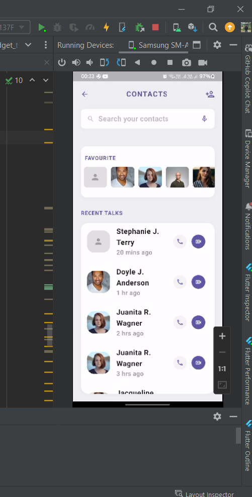
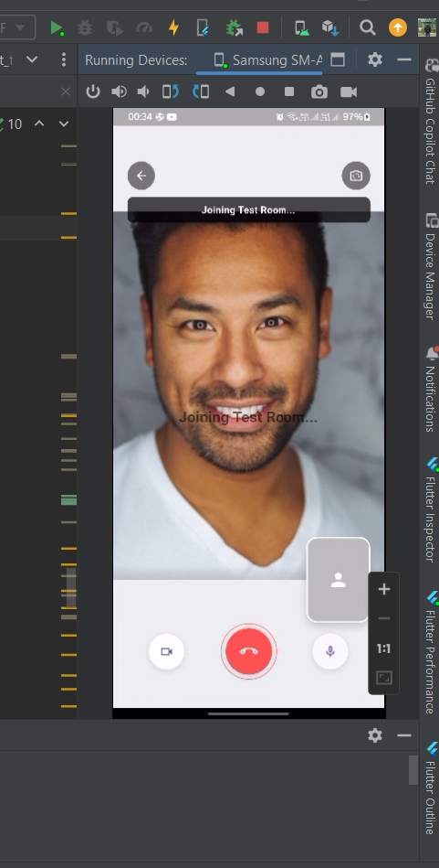
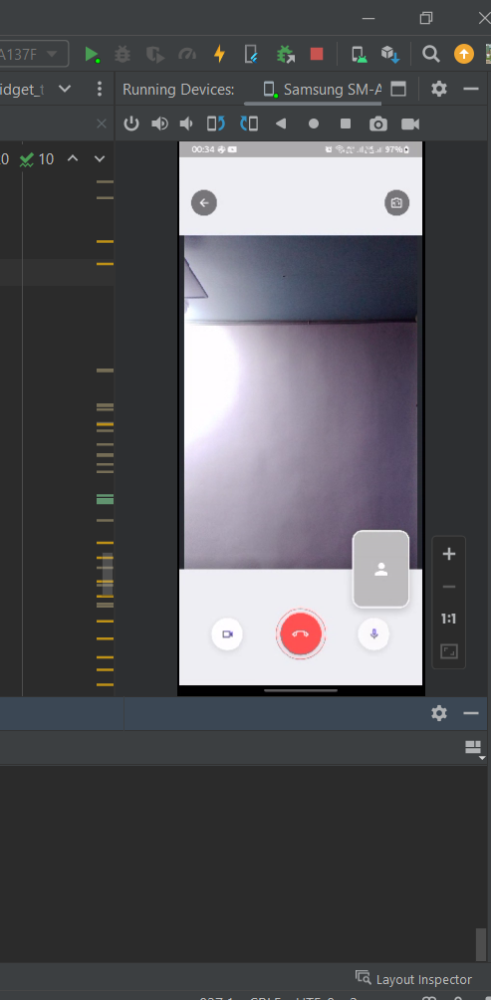

# Flutter Group Video Call App (Stream Video)

A full-featured Flutter group video call app using [Stream Video Flutter SDK](https://getstream.io/video/) and JWT authentication.

## Github repo:
- https://github.com/MohammedNAbdelsamea/flutter_video_calls
## 📸 Screenshots




## 🔧 Features

- Join video rooms using Stream's `Call` API
- Auto-generate user tokens via JWT (secure)
- Camera & microphone permissions
- Toggle audio/video
- Flip camera
- Leave call
- Custom UI for call control & status
- Automatically joins a predefined room

## 📦 Dependencies

```yaml
dependencies:
  flutter:
    sdk: flutter
  cupertino_icons: ^1.0.8
  stream_video_flutter: ^0.10.0
  permission_handler: ^12.0.1
  uuid: ^4.5.1
  dart_jsonwebtoken: ^3.2.0
```

## 🚀 Getting Started

### 1. Setup your Stream account

- Go to [Stream.io](https://getstream.io/video/)
- Create an account and project
- Copy your **API Key** and **Secret**

### 2. Replace your credentials

In your Dart file, replace the following:

```dart
static const String apiKey = 'YOUR_API_KEY';
const String apiSecret = 'YOUR_SECRET';
```

### 3. Run the app

```bash
flutter pub get
flutter run
```

## 📸 UI Preview

- Splash/loading screen while initializing
- Automatically joins the `Test Room`
- Custom floating control buttons overlaid on the video stream

## 📄 File Overview

- `VideoCallScreen.dart`: Main screen with all functionality
- JWT token is generated locally using `dart_jsonwebtoken`

## ✅ Permissions

Don't forget to update `AndroidManifest.xml`:

```xml
<uses-permission android:name="android.permission.CAMERA"/>
<uses-permission android:name="android.permission.RECORD_AUDIO"/>
```

For iOS, add the following to `Info.plist`:

```xml
<key>NSCameraUsageDescription</key>
<string>Need access to camera</string>
<key>NSMicrophoneUsageDescription</key>
<string>Need access to microphone</string>
```

## 🛡️ Notes

- This implementation uses local JWT generation — **not for production**.
- For production, generate the token securely on your backend.

---


